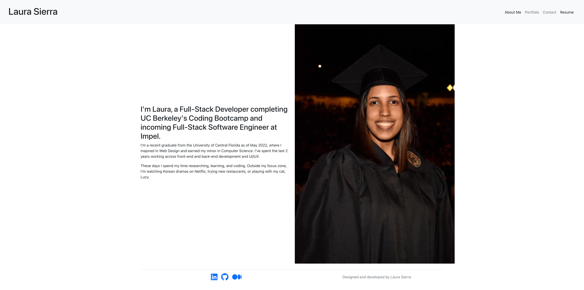

# Laura Sierra's Portfolio

This portfolio dives a little into my background and includes 6 projects of mine, a resume ready for download, and a contact form! Built using React.

Check it out [here](https://laurasierra17.github.io/react-portfolio/).

## Screenshots


# Table of Contents
* [Installation](#installation)
* [Usage](#usage)
* [License](#license)
* [Contributing](#contributing)
* [Technologies Used](#technologies-used)
* [Code Snippets](#code-snippets)
* [Questions](#questions)
* [User Information](#user-information)

## Installation
To install necessary dependencies, run the following command:
```
npm i
```
To run the application, run the following command:
```
npm start
```

## Usage
Install the dependencies and you're ready to go.

## License 
This project is licensed under the MIT license.

## Contributing
Contact me.

## Technologies Used
- React.js
- Bootstrap

## Code Snippets
```javascript
export default function Portfolio() {
    return projects.map(project => (
        <div className="d-flex flex-row">
            <Project project={project} />
        </div>
    ))
}
```
To dynamically populate the Projects page, I have set up an array of project objects with the necessary informatin to display. Inside `Portfolio.js`, I iterate through the projects array and generate a Project component for each project in the array.

## Questions
If you have any questions about the repo, open an issue or contact me directly at laura.sierra17@gmail.com.
You can find more of my work at [laurasierra17](https://www.github.com/laurasierra17).

## User Information
- [LinkedIn](https://www.linkedin.com/in/laurasierra2022)
- [Portfolio](http://www.laura-sierra.com)